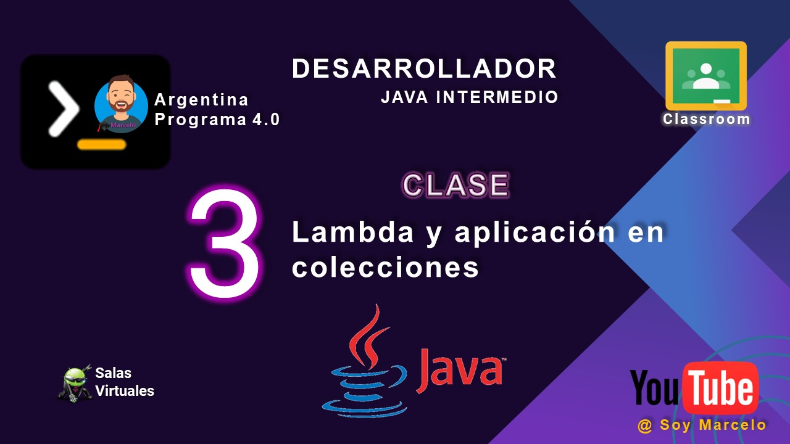

# clase_03
## Lambda y aplicación en colecciones

## EJERCICIO 1
Implemente un método que reciba como parámetro una lista de strings y devuelva una nueva
lista con los strings en mayúscula.

## EJERCICIO 2
Implementar un método que reciba como parámetro una lista de strings y un entero "n". El
método debe devolver un String que concatene separando por coma y espacio todas las
palabras, en la lista, que tengan más de "n" caracteres.

## Youtube

